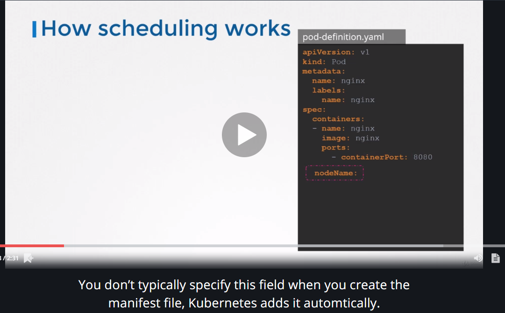
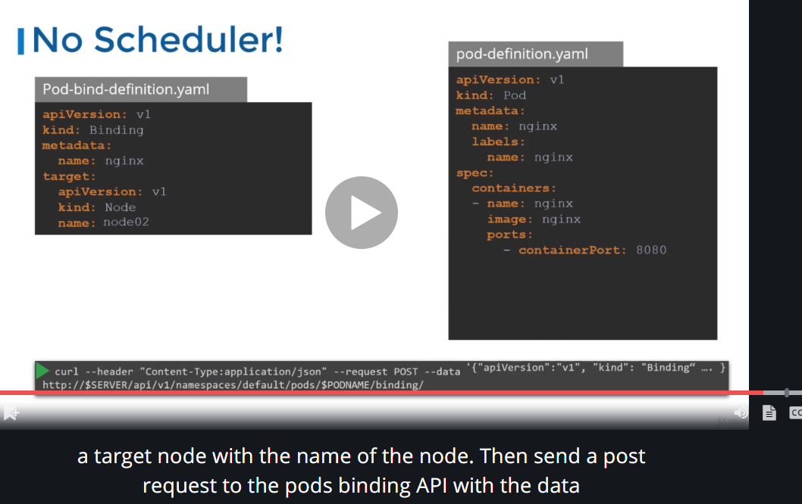

# 手动调度

每个`pod`都有一个叫做`nodeName`的`section`.默认情况下,是没有设置值的.
`kubernetes`会自动为其增加这个值.

2. 调度器会遍历所有的`pod`,然后识别出没有设置这个属性的`pod`.这些`pod`就是待调度的`pod`.
3. 调度器通过一定的调度算法,决策出`pod`应该调度到哪个`node`上,然后通过设置这个值,将`pod`调度到`node`上.
4. 设置值的方式是通过创建一个`binding`对象.
5. 假如不存在`schedule`进程,可以通过手动指定`nodeName`的方式,将`pod`调度到某个`node`上.
6. 不允许修改已经创建好的`pod`的`nodeName`属性.
7. 如果要修改已经创建好的`pod`,需要创建`binding`对象,然后`mimicking`调度进程(也就是发送`rest`请求)实现调度.
8. 