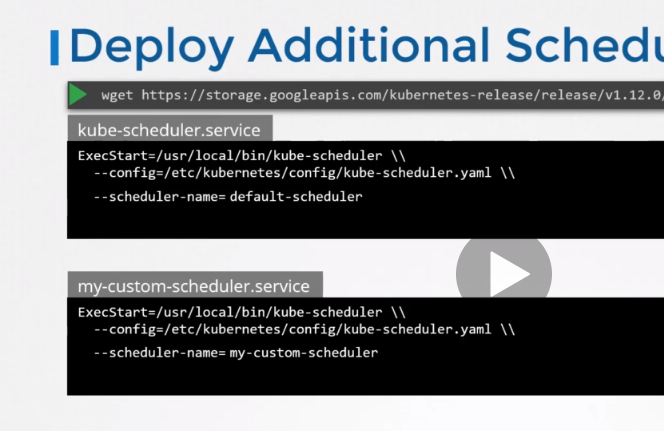
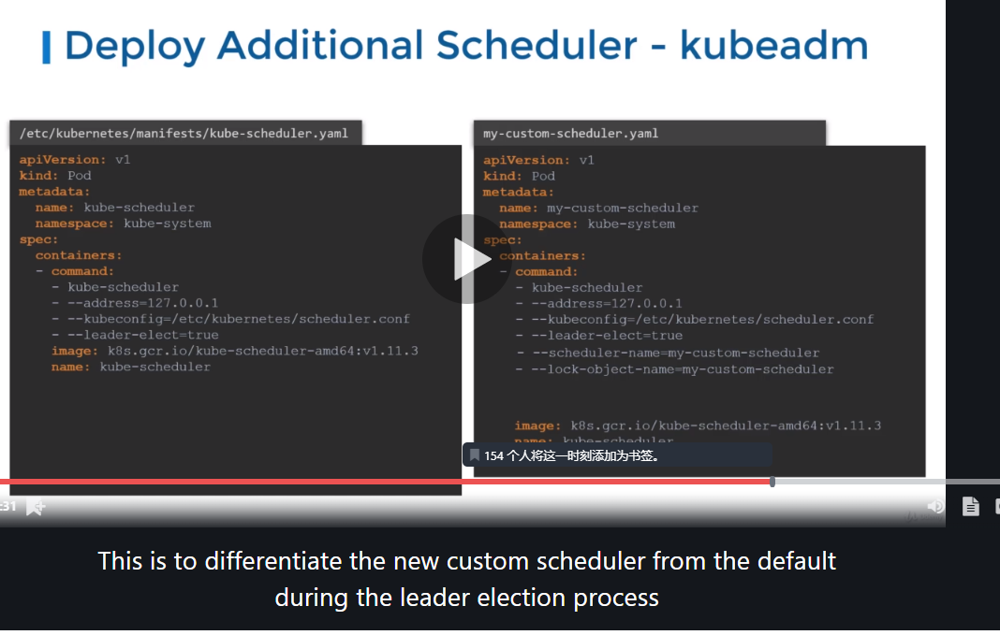
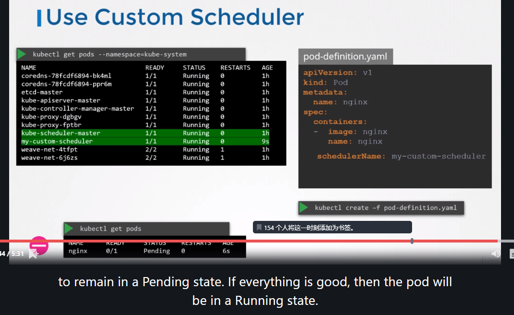

# 多调度器

同一个集群可以有多个调度器.

当创建`pod`和`deployment`的时候,可以指示`k8s`使用哪个调度器进行调度.

调度器启动参数:

`kubeadm`把调度进程以`pod`的形式部署,这个可以在`kube-system`的`ns`下观察到.

定义文件的位置:`/etc/kubernetes/manifests/xxxscheduler.yaml`

关于高可用部署:

当只有一个`master`,且需要多个调度器的时候,需要把`--leader-elect`置为`false`.这样不会启动选主操作.

如果有多个`master`,(高可用部署),需要把`--leader=elect`置为`true`,同时,指定`lock-object-name`,这样是为了在主备选举过程中区分默认调度器和新调度器.
